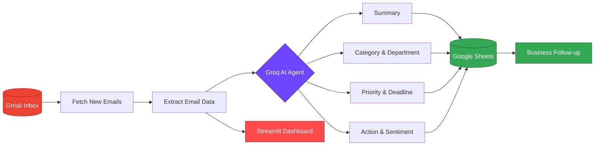
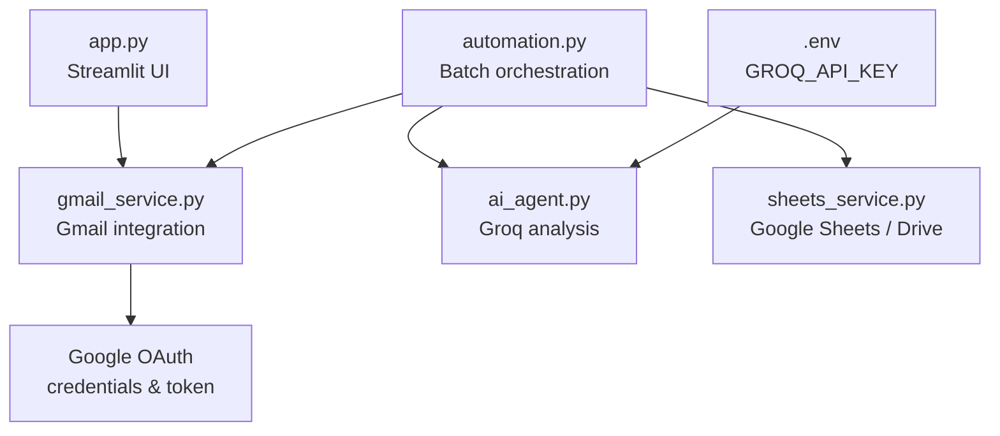

<div align="center">


<p>
  <a href="https://github.com/sawsanzaky/AI-Gmail-Automation-Agent/stargazers"></a>
  <a href="https://github.com/sawsanzaky/AI-Gmail-Automation-Agent/network/members"></a>
  <a href="https://www.python.org/"></a>
  <a href="https://streamlit.io/"></a>
</p>

<p>
  <a href="https://groq.com/"></a>
  <a href="https://developers.google.com/gmail/api"></a>
  <a href="https://developers.google.com/sheets/api"></a>
</p>

<p><strong>Intelligent email processing and business workflow automation</strong></p>

<p>
  <a href="#-why-this-project">Why this project</a> ·
  <a href="#-capabilities">Capabilities</a> ·
  <a href="#-architecture">Architecture</a> ·
  <a href="#-quick-start">Quick start</a> ·
  <a href="#-configuration">Configuration</a>
</p>

</div>

---

## 🎯 Why this project?

Teams lose valuable time manually reading, classifying, summarizing, and routing email. **AI Gmail Automation Agent** creates a practical bridge between your Gmail inbox and your business operations.

It retrieves recent messages, asks an AI model to produce consistent business metadata, and writes the results to a structured Google Sheets workflow. A Streamlit interface provides a visual way to inspect the latest messages.

<div align="center">

| 📥 Capture | 🧠 Understand | 🗂️ Organize | 📊 Act |
|:---:|:---:|:---:|:---:|
| Gmail messages | AI summaries | Categories & priority | Sheets workflow |

</div>

## ✨ Capabilities

<table>
<tr>
<td width="50%">

### 📬 Gmail monitoring

- Authenticate with the Gmail API
- Retrieve recent messages
- Read sender, recipient, subject, date, and body
- Inspect messages through the Streamlit dashboard

</td>
<td width="50%">

### 🤖 AI email intelligence

- Generate concise business summaries
- Detect category and department
- Assign `Low`, `Medium`, or `High` priority
- Extract deadlines and required actions
- Identify email sentiment

</td>
</tr>
<tr>
<td width="50%">

### 🔁 Workflow automation

- Process new messages in batches
- Append AI results to Google Sheets
- Keep business information structured
- Reduce repetitive manual data entry

</td>
<td width="50%">

### 📈 Visual experience

- Clean Streamlit control panel
- Adjustable number of emails to load
- Expandable email detail cards
- Status indicators for connected services

</td>
</tr>
</table>

## 🧭 Workflow at a glance



## 🏗️ Architecture



## 📂 Project structure

```text
AI-Gmail-Automation-Agent/
├── app.py              # Streamlit dashboard for inspecting Gmail messages
├── automation.py       # Batch processing orchestration
├── ai_agent.py         # Groq-powered email analysis and JSON extraction
├── gmail_service.py    # Gmail API authentication and message retrieval
├── sheets_service.py   # Google Sheets / Drive integration
├── requirements.txt    # Python dependencies
├── .env                # Local secrets; never commit
└── README.md
```

## 🚀 Quick start

### 1. Clone the repository

```bash
git clone https://github.com/sawsanzaky/AI-Gmail-Automation-Agent.git
cd AI-Gmail-Automation-Agent
```

### 2. Create and activate a virtual environment

```bash
python -m venv .venv

# Windows
.venv\Scripts\activate

# macOS/Linux
source .venv/bin/activate
```

### 3. Install dependencies

```bash
pip install -r requirements.txt
```

> The application also imports `streamlit` and `groq`. If they are not already included in your local dependency file, install them with `pip install streamlit groq`.

### 4. Launch the dashboard

```bash
streamlit run app.py
```

Open `http://localhost:8501` in your browser.

## 🔐 Configuration

### Groq

Create a `.env` file in the project root:

```env
GROQ_API_KEY=your_groq_api_key
```

### Google APIs

1. Open the [Google Cloud Console](https://console.cloud.google.com/).
2. Create or select a project.
3. Enable the **Gmail API**, **Google Sheets API**, and **Google Drive API**.
4. Configure the OAuth consent screen.
5. Create OAuth client credentials for a desktop application.
6. Download the credentials file expected by the Google service modules.
7. Complete the browser authentication flow on first run.

> Never publish API keys, OAuth client secrets, `credentials.json`, or generated token files. Confirm they are covered by `.gitignore` before committing.

## 🧪 AI output schema

For each processed message, the AI agent returns structured JSON:

```json
{
  "summary": "Concise business summary",
  "category": "Finance",
  "priority": "High",
  "deadline": "2026-10-01",
  "action_required": "Review and respond to the request",
  "department": "Finance",
  "sentiment": "Neutral"
}
```

This makes unstructured conversations easier to filter, prioritize, assign, and follow up.

## 🖼️ Dashboard preview

<div align="center">
  
</div>

## 🛡️ Security checklist

- [ ] Keep `.env` out of version control.
- [ ] Do not commit Google OAuth credentials or tokens.
- [ ] Use the smallest practical Google API scopes.
- [ ] Rotate any credential that is accidentally exposed.
- [ ] Review AI-generated results before taking critical business actions.

## 🤝 Contributing

1. Fork the repository.
2. Create a branch: `git checkout -b feature/your-feature`.
3. Make and test your changes.
4. Commit and push your branch.
5. Open a pull request with a clear description.

## 📄 License

Add your preferred license information here.

<div align="center">


<strong>Automate email. Surface intelligence. Move work forward.</strong>

</div>
